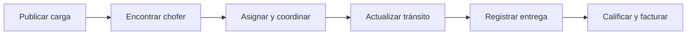

<p align="center">
  
</p>

<h1 align="center">Del primer kilómetro a la factura, todo en orden.</h1>

<p align="center">
  Plataforma web para publicar cargas, coordinar choferes y dar seguimiento a cada operación desde un solo lugar.
</p>

<p align="center">
  <a href="https://github.com/P3terPl4y/BUFALO">Repositorio</a> ·
  <a href="https://bufalo.duohnson.com/">Plataforma</a> ·
  <a href="docs/DEPLOY_PRODUCCION.md">Guía de despliegue</a>
</p>

<p align="center">
  
  
  
  
</p>

<p align="center">
  
</p>

## Una operación, con contexto de principio a fin

BUFALO reúne a publicadores, choferes y administradores alrededor del recorrido de cada carga. Los equipos pueden organizar empresas y direcciones, definir quién ve una publicación, coordinar asignaciones y consultar la información de facturación con permisos asociados al rol.

La interfaz está pensada para que cada persona encuentre las acciones de su trabajo diario y pueda seguir el estado de una operación sin perder de vista sus responsables.

## Lo que puedes hacer

| Cargas y rutas | Equipos y confianza | Facturación y control |
|---|---|---|
| Publicar cargas con origen, destino, fechas, tarifa y tipo de carga. | Crear una red privada de choferes y limitar cargas a esa red o hacerlas públicas. | Crear y consultar facturas asociadas a la operación y a sus responsables. |
| Coordinar asignación, tránsito y entrega. | Consultar perfiles y calificaciones de choferes. | Exportar facturas en PDF, CSV y Excel. |
| Guardar direcciones con coordenadas y consultar rutas en el mapa. | Mantener datos de empresa y perfiles según los permisos de cada cuenta. | Consultar métricas de usuarios, cargas, facturas y salud del servicio desde el panel de administración. |

## Un flujo claro para cada rol

**Empresa o publicador** prepara los datos de la operación, publica la carga para todos o para su red, coordina la asignación y gestiona las facturas que le corresponden.

**Chofer** completa su perfil, consulta las cargas disponibles para su rol y sus redes, acepta una operación y actualiza su progreso hasta registrar la entrega. También puede consultar y exportar sus facturas y recibir calificaciones.

**Administrador** gestiona usuarios y supervisa el sistema desde el panel, incluidas métricas generales y comprobaciones de salud.



## Tecnología

- **Backend:** Go 1.25, Goravel y Fiber v3.
- **Persistencia:** PostgreSQL mediante GORM.
- **Sesiones y limitación distribuida:** Redis.
- **Interfaz:** plantillas HTML, CSS y JavaScript; diseño adaptable a móvil y escritorio.
- **Mapas:** Leaflet y servicios de OpenStreetMap para búsqueda de direcciones.
- **Despliegue:** Docker Compose o Linux con systemd.

## Ejecutar en desarrollo

Necesitas Go 1.25, PostgreSQL y Redis. Configura las variables de entorno en un archivo local `.env` y no guardes secretos en Git. La plantilla de producción está en [`.env.production.example`](.env.production.example).

```bash
git clone git@github.com:P3terPl4y/BUFALO.git
cd BUFALO
cp .env.production.example .env
# Edita .env con valores locales de PostgreSQL, Redis y APP_KEY
go run .
```

La aplicación escucha por defecto en `http://localhost:3000`. Para preparar una instancia real, sigue la [guía de despliegue](docs/DEPLOY_PRODUCCION.md), que incluye migraciones, persistencia, respaldos y comprobaciones posteriores al arranque.

## Pruebas y calidad

Ejecuta las pruebas unitarias que no dependen de una base de datos de integración con:

```bash
go test ./app/billing ./app/community ./app/exports ./app/models ./app/monitoring ./app/http/middleware ./app/viewhelpers ./routes
```

Las suites de controladores, servicios y flujos de extremo a extremo requieren una base PostgreSQL de pruebas configurada. No las ejecutes contra una base de producción. La cobertura documentada de pruebas de usuario está en [`docs/TEST_E2E_PRODUCCION_2026-10-04.md`](docs/TEST_E2E_PRODUCCION_2026-10-04.md).

## Estructura del proyecto

```text
app/                 Controladores, modelos, servicios, permisos y lógica de negocio
database/migrations/ Cambios versionados del esquema
routes/              Rutas HTTP
public/              Landing, recursos estáticos y JavaScript
docs/                Auditoría, pruebas y despliegue
deploy/              Unidad de servicio systemd
tests/               Suites de integración y seguridad
```

## Contacto

**Desarrolladores:** Elvin Felipe Torres y Marcelo Tamayo
**Correo:** [elvinfelipetorres@gmail.com](mailto:elvinfelipetorres@gmail.com)
**GitHub:** [P3terPl4y](https://github.com/P3terPl4y) · [Repositorio BUFALO](https://github.com/P3terPl4y/BUFALO)

---

<p align="center"><sub>BUFALO · Gestión logística para equipos que avanzan.</sub></p>
